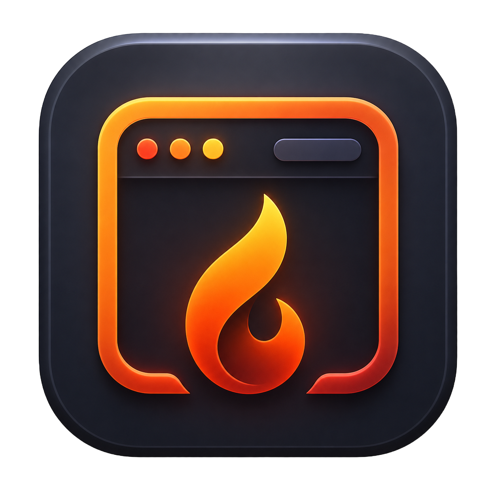

<p align="center">
  
</p>


# FireFrame

FireFrame turns a cheap Amazon Fire tablet into a wall- or desk-mounted control panel for your Mac. Has things like buttons to trigger macOS Shortcuts and apps, live system stats, a Bluetooth device picker, your calendar, timers, and a photo slideshow. The server runs on the Mac, but the tablet is just a browser pointed at it over your local Wi-Fi.

It is macOS-first. On other systems the UI still runs, but the macOS-specific features (Bluetooth, Calendar, Shortcuts) show a clear "unavailable" state.

## Why I built this

I got a Fire HD 8 for free. Fire OS is too locked down and the hardware too slow to make it a good tablet, but it has a fine screen and Wi-Fi, which is all you need for a screen that sits on a stand and does one job. I wanted a touchscreen control panel for my Mac without buying dedicated hardware, so I built a small web app the tablet could display full-screen and used it to drive Focus modes, app launches, and a calendar glance. FireFrame is that project, cleaned up.

## Features

- **Home** is the dashboard: clock, next calendar events, CPU/memory/storage/battery meters, Bluetooth status, an inline timer, quick actions, and an app launcher.
- **Buttons** is the full control deck, grouped into Focus modes, Mac controls, app launches, timers, and maintenance.
- **Bluetooth** lists paired devices and connects/disconnects them (with `blueutil` installed).
- **Calendar** shows a day/week schedule grid from Apple Calendar, an `.ics` file or URL, or demo data.
- **Stats** is a live view of CPU, memory, storage, battery, network throughput, and top processes.
- **Photos** is a slideshow with shuffle, pause, lock, and manual navigation.
- **Timers** are preset or custom countdowns that finish with a quiet macOS notification.

## How it works

The browser never sends commands. It sends a fixed action key (for example `dnd`), and the server looks that key up in an allowlist (`SHORTCUT_ACTIONS`) and runs the matching `shortcuts run`, `open`, or small built-in command. There is no `shell=True` anywhere, and every endpoint requires a signed session cookie.

Treat the tablet as untrusted and do not sign it into personal accounts. Run FireFrame on a trusted LAN only; never port-forward it or put it behind a public tunnel. See [SECURITY.md](SECURITY.md) for the full model.

## Requirements

- A Mac for the full feature set.
- Python 3.10+.
- A tablet or any device with a browser. The Fire tablet uses [Fully Kiosk Browser](https://www.fully-kiosk.com/) in order to keep the tablet fully fullscreen.
- Optional: [`blueutil`](https://github.com/toy/blueutil) for Bluetooth connect/disconnect. The fast Apple Calendar reader (`pyobjc-framework-EventKit`) is in `requirements.txt` and installs automatically on macOS; on other systems pip skips it.

## Setup

```bash
python3 -m venv .venv
source .venv/bin/activate
pip install -r requirements.txt

cp .env.example .env      # then set DASHBOARD_PASSWORD and SESSION_SECRET
./scripts/start.sh        # serves on 0.0.0.0:8765
```

Find your Mac's LAN IP (System Settings > Wi-Fi > Details, something like `x.x.x.x`) and open `http://<MAC_IP>:8765` on the tablet.

- Set a real `SESSION_SECRET` (for example `python3 -c "import secrets; print(secrets.token_hex(32))"`). The server refuses to start while it is left at the default, since that value is public and would let anyone forge a session.
- The login PIN is your `DASHBOARD_PASSWORD`. A 4-digit value works with the on-screen keypad; longer passwords use the keyboard fallback.
- `.env` is read once at startup, so restart the server after editing it.
- To customize buttons, the app launcher, or the Prepare apps and links, copy `backend/config.example.py` to `backend/config.py` (gitignored) and edit it there.

## Configuration

Everything is set in `.env` (copied from `.env.example`). Nothing personal is committed.

| Variable | Default | Purpose |
|---|---|---|
| `DASHBOARD_PASSWORD` | `change-me` | Login PIN / password |
| `SESSION_SECRET` | `change-this-random-string` | Signs the session cookie; use a long random value |
| `PORT` | `8765` | Server port |
| `CALENDAR_SOURCE` | `none` | `none`, `demo`, `ics`, or `apple` |
| `CALENDAR_ICS_PATH` | empty | `.ics` file path or https URL (for `ics`) |
| `CALENDAR_ICS_PATHS` | empty | Several `.ics` paths at once, `:`-separated |
| `CALENDAR_UPCOMING_DAYS` | `7` | Days ahead the Home card looks |
| `CALENDAR_REFRESH_SECONDS` | `300` | How long calendar reads are cached |
| `PHOTOS_DIR` | empty (uses `./photos`) | Folder to read photos from |
| `PHOTO_INTERVAL_SECONDS` | `30` | Slideshow interval |
| `BLUETOOTH_ALLOW_CONNECT` | `1` | Set `0` to disable connect/disconnect |
| `BLUEUTIL_PATH` | empty | Path to blueutil (auto-detected if empty) |
| `TIMER_SOUND` | `Glass` | macOS sound for the timer notification; `""` for silent |
| `WEATHER_ENABLED` | `0` | Set `1` to show the optional weather card |
| `WEATHER_SHORTCUT` | `FireFrame Weather` | Shortcut that prints the weather string |

## Calendar

Set `CALENDAR_SOURCE`, restart, and open the Calendar tab. It is a schedule grid with Day and Week views (Week by default): a Today button, prev/next navigation, a time axis, event blocks placed by time, and a separate all-day row. When more than one calendar has events, filter chips appear so you can hide or show each one.

**Apple Calendar (`apple`) is the recommended source.** It reads every calendar in Calendar.app (including Google accounts if added there) and expands recurring events.

1. Set `CALENDAR_SOURCE=apple`.
2. The fast reader (`pyobjc-framework-EventKit`) installs automatically on macOS with `pip install -r requirements.txt`. If your calendar is slow, it is missing (for example after rebuilding the virtualenv); reinstall it into the same environment that runs the server with `./.venv/bin/pip install pyobjc-framework-EventKit`. Without it, FireFrame falls back to a slower AppleScript path that can time out on large calendars.
3. Restart. The first load asks for Calendar access; approve it. If it errors, enable it under System Settings > Privacy & Security > Calendars (and Automation if you are on the AppleScript fallback). The grant attaches to whatever launches the server, so re-approve if you change how you start it.

**ICS file or URL (`ics`)** suits a single calendar without Calendar.app. For Google, open the calendar's Settings and sharing > Integrate calendar > Secret address in iCal format, then:

```
CALENDAR_SOURCE=ics
CALENDAR_ICS_PATH=https://calendar.google.com/calendar/ical/.../basic.ics
```

That URL is a credential. Keep it in `.env` (gitignored) and never commit it. The built-in parser does not expand recurring events, so prefer `apple` for recurring-heavy calendars. For several calendars at once, list paths in `CALENDAR_ICS_PATHS` separated by `:`.

**`demo`** shows placeholder events; **`none`** (the default) shows "not connected".

## Bluetooth

Listing and status work out of the box via `system_profiler` (read-only, no extra tools). Real device addresses stay on the Mac; the tablet only sees an opaque token per device.

Connect/disconnect needs [`blueutil`](https://github.com/toy/blueutil):

```bash
brew install blueutil
```

`blueutil` acts on already-paired devices, so pair new ones in macOS Bluetooth settings first. You can also point `BLUEUTIL_PATH` at an explicit location. Bluetooth control is macOS-only.

## Buttons and shortcuts

Every button maps to an entry in the `SHORTCUT_ACTIONS` registry (defaults in `backend/config_loader.py`, overridable in `backend/config.py`). Supported action types are `shortcut` (run a macOS Shortcut by name), `open_app`, `open_url`, `open_app_or_url`, and a few fixed commands (`mute`, `sleep_mac`, `prepare`).

Focus modes have no command-line equivalent on macOS, so they go through Shortcuts you create in the Shortcuts app. Everything else works out of the box.

| Button | What it does | How | Setup |
|---|---|---|---|
| DND | Do Not Disturb / Focus | Shortcut | Create `FireFrame DND` |
| Locked In | Deep-work Focus | Shortcut | Create `FireFrame Locked In` |
| Presentation | Presentation Focus | Shortcut | Create `FireFrame Presentation Mode` |
| Break | Break Focus | Shortcut | Create `FireFrame Break Mode` |
| Sleep Mode | Sleep Focus (not sleeping the Mac) | Shortcut | Create `FireFrame Sleep Mode` |
| Quick Note | New quick note | Shortcut | Create `FireFrame Quick Note` |
| Sleep Mac | Sleeps the Mac (asks to confirm) | `pmset sleepnow` | none |
| Mute | Toggles system mute | `osascript` | none |
| Display | Opens Display settings | `open` URL | none |
| Spotify / GPT / Wallpapers | Open the app (GPT falls back to the website) | `open -a` | install the app |
| Prepare | Opens your work apps and links | `open` | set `PREPARE_APPS` / `PREPARE_URLS` |
| Restart | Shows restart instructions | info modal | none |

The six Shortcuts to create in the Shortcuts app: `FireFrame DND`, `FireFrame Locked In`, `FireFrame Presentation Mode`, `FireFrame Break Mode`, `FireFrame Sleep Mode`, `FireFrame Quick Note`. Test any of them from a terminal with, for example, `shortcuts run "FireFrame DND"`.

App names like Spotify, ChatGPT, and iWallpaper are generic placeholders. If yours differ, change the `app` value in `backend/config.py`; an app that is not installed produces a clean error. To remove a button entirely, delete its entry from `SHORTCUT_ACTIONS`. Sleep Mac is the only action that asks for confirmation, so a stray tap or background refresh cannot trigger it.

The Home screen reuses this same registry for its Quick Actions and the app launcher (`launch_chrome`, `launch_vscode`, `launch_terminal`, `launch_notes`, `launch_finder`, `bluetooth_settings`, and the apps above).

## Timers

Timers run as FireFrame's own countdown rather than the Clock app, so presets and custom durations behave the same and never set off a loud alarm.

- Presets: 5, 15, 25 (Focus), and 45 (Work) minutes.
- Custom: an hours-and-minutes entry plus quick 10/20/30/60 chips, validated from 1 minute to 24 hours.
- Controls: pause/resume, reset, and cancel. Only one timer runs at a time, and a small countdown chip stays visible above the bottom nav on every tab.

When a timer finishes, the tablet shows a calm "Done" state and the Mac posts a passive notification with a soft sound (`TIMER_SOUND`, default `Glass`). The notification respects Do Not Disturb and Focus, so it will not interrupt focused work.

macOS attributes `osascript` notifications to Script Editor. If you do not see banners, allow notifications for Script Editor under System Settings > Notifications. To verify:

```bash
osascript -e 'display notification "Timer finished" with title "FireFrame Timer" sound name "Glass"'
```

## Photos

Drop images into `photos/`, or set `PHOTOS_DIR` to a folder outside the repo. The Photos tab has shuffle, pause/resume, lock-on-photo, and manual navigation; those choices persist in the browser via `localStorage`. Personal photos are gitignored and never committed.

## Weather (optional)

There is no API-key-free system weather command on macOS, so FireFrame reads weather from a Shortcut you own. No third-party API, and your location and units stay inside the Shortcut.

1. Create a Shortcut named `FireFrame Weather` that ends by outputting a short string (for example a Get Current Weather action feeding a Text action like `(Temperature) (Conditions)`, then Stop and output).
2. Verify it: `shortcuts run "FireFrame Weather" --output-path -` should print the string.
3. Set `WEATHER_ENABLED=1`.

The result is cached for about 30 minutes. When disabled the card is hidden.

## Running on the tablet

Use Fully Kiosk Browser on the Fire tablet with these settings:

| Setting | Value |
|---|---|
| Start URL | `http://<MAC_IP>:8765` |
| Fullscreen | on |
| Hide address bar | on |
| Keep screen on | on |
| Orientation | landscape |
| Reload on network reconnect | on |

Give the Mac a static IP with a DHCP reservation on your router so the Start URL keeps working after a reboot. Login is a tap-based PIN pad with a keyboard fallback, rate-limited to 5 attempts before a 30-second lockout. The page is served with no-cache headers and versioned assets, so a reload always picks up new code.

## Project structure

```
backend/
  main.py             FastAPI app, routes, login, rate limiting
  auth.py             session cookies and the auth dependency
  config_loader.py    env + optional config.py, default action registry
  config.example.py   template for a local backend/config.py
  actions.py          button actions, timer notification, weather
  bluetooth.py        system_profiler scan, blueutil connect/disconnect
  calendar_service.py Apple Calendar / ICS / demo sources
  calendar_stub.py    demo events
  mac_stats.py        full stats for the Stats tab
  stats.py            lightweight stats for the Home summary
  health.py           config/feature status for Settings
  photos.py           photo listing and folder open
frontend/
  index.html          single-page UI
  app.js              all client logic
  style.css           dark theme
  manifest.json       PWA manifest
scripts/
  start.sh / stop.sh  launch and stop helpers
  launchd/            optional login-agent example
fireframe.command     double-click launcher for macOS
```

## Running without a terminal (macOS)

- `fireframe.command`: double-click in Finder to start the server. It prints the tablet URL and can be dragged to the Dock.
- Login agent: `scripts/launchd/` has an example `launchd` plist to start the server at login. Copy it to `~/Library/LaunchAgents/`, set the absolute path to `scripts/start.sh`, and load it with `launchctl`.

## Make it an app in your Applications folder

You can wrap the launcher in a real `.app` so FireFrame lives in `/Applications` with its own icon and opens from Spotlight, Launchpad, and Dock.

1. Open **Automator** and create a new document of type **Application**.
2. Add a **Run Shell Script** action and paste this, using the path to where you cloned FireFrame:
   ```bash
   open "$HOME/path/to/FireFrame/fireframe.command"
   ```
   This reuses the existing launcher, so the server still opens in Terminal and prints the tablet URL. Close that window (or press Ctrl-C) to stop it.

3. Save it as **FireFrame Launcher** into your Applications folder.

In order to **give it the FireFrame icon**:

1. Open [FireFrame_Logo.png](FireFrame_Logo.png) in Preview and copy it (Cmd-C).
2. Select FireFrame.app in Finder and open Get Info.
3. Click the small icon in the top-left of the Info window and paste (Cmd-V)

## Developing on another machine

The server runs anywhere; only the macOS-specific features are inert off macOS.

```bash
python3 -m venv .venv
./.venv/bin/python -m pip install -r requirements.txt
./.venv/bin/python -m uvicorn backend.main:app --host 127.0.0.1 --port 8765 --reload
```

To reach a remote dev box without exposing a port: `ssh -L 8765:127.0.0.1:8765 <dev-box>`.

### Tests

The suite covers auth, the session-cookie signing, and action dispatch/input sanitizing. It runs anywhere (no macOS or network needed):

```bash
./.venv/bin/python -m pip install -r requirements-dev.txt
./.venv/bin/python -m pytest
```

## Troubleshooting

- New PIN does not work: restart the server, since `.env` is read only at startup.
- Shortcut buttons fail: check the Shortcut names match exactly and that the process running the server has Automation permission.
- Calendar error: for `apple`, grant Calendar/Automation permission; otherwise use an `.ics` source.
- Bluetooth connect greyed out: install `blueutil` (or drop the binary in `./bin/`) and restart. Listing and status work without it.
- Remove a button: delete its entry from `SHORTCUT_ACTIONS` in `backend/config.py`.
